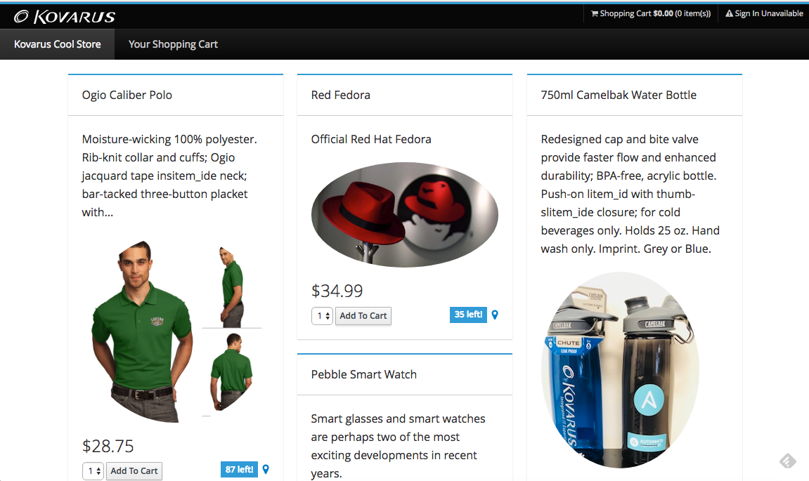

# web-nodejs

This is the web UI front-end to the coolstore application.

It is written in Node.js and AngularJS

Please be sure you have deployed the required microservices before launching the Web UI:

1. [https://github.com/bugbiteme/catalog-spring-boot](https://github.com/bugbiteme/catalog-spring-boot)
2. [https://github.com/bugbiteme/inventory-wildfly-swarm](https://github.com/bugbiteme/inventory-wildfly-swarm)
3. [https://github.com/bugbiteme/gateway-vertx](https://github.com/bugbiteme/gateway-vertx)

## Deploy web-nodejs to OpenShift

First, make sure you are in the coolstore project:

`$ oc project coolstore`

Use the OpenShift CLI command to create a new build and deployment for the Web component:

`oc new-app nodejs~https://github.com/bugbiteme/web-nodejs.git --name=web`

A build gets created and starts building the Node.js Web UI container image. You can see the build logs using OpenShift Web Console or OpenShift CLI:

`oc logs -f bc/web`

In order to access the Web UI from outside (e.g. from a browser), it needs to get added to the load balancer. Run the following command to add the Web UI service to the built-in HAProxy load balancer in OpenShift.

~~~~
oc expose svc/web
oc get route web
~~~~

Point your browser at the Web UI route url. You should be able to see the CoolStore with all products and their inventory status.

